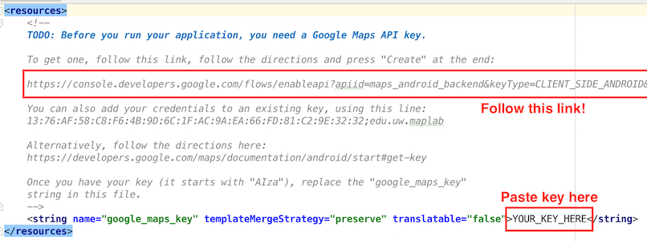

# 04-26 Lab: Maps
This lab will introduce you to the [Google Maps Android API](https://developers.google.com/maps/documentation/android-api/) which allows you to _very_ easily add an interactive map to your application. This is a brand new set of classes and methods that you will need to use for your homework, but they are simple and flexible enough that it's more effective to play around with them and discover the functionality on your own.

- You can complete this lab either on the emulator or a physical device. Any SDK level will do, _but make sure that your emulator has the Google APIs included!_

### 1. Create a Map Activity
There is no starter code for this lab, you will be creating a new project from scratch. But it's pretty easy to get the infrastructure in place.

Start a new project in Android Studio ("Map Lab" is a fine project name; you can save it in this cloned repo if you want to save your work). Target SDK 15 like usual.

_But Here's where things get different!_ Instead of starting with an "Empty Activity", start with a (cough) **Google Maps Activity**. This will create you a new `Activity` whose layout includes an XML-defined [`SupportMapFragment`](https://developers.google.com/android/reference/com/google/android/gms/maps/SupportMapFragment). (This is just another Fragment subclass, so you could include it in a layout however you wanted. You can stick with the default layout for now).

### 2. Getting an API Key
In order to access and show a Google Map, you need to [register and get an API key](https://developers.google.com/maps/documentation/android-api/signup#key) (this is like a special password that lets your app access Google's data). When you create the Maps Activity, Android Studio should open up the `google_maps_api.xml` resource file. This file contains instructions on how to get an API key (i.e., paste the giant pre-generated link into your browser, and then copy the generated key into the XML resource).

(If you already have a Google Maps API Key, you can add this package & device to that key in the [Google Developer Console](https://console.developers.google.com/apis/credentials)).

After you've entered the key, you should be able to build and run your app, and see a the displayed map!

### 3. The `SupportMapFragment`
Take a moment to open up the generated `MapsActivity` and its associated layout (by default `layouts/activity_maps.xml`) and **read over the initial code**:

- The layout resource contains a single `<fragment>` element (like we've defined before), in this case referring to an instance of the [`SupportMapFragment`](https://developers.google.com/android/reference/com/google/android/gms/maps/SupportMapFragment) class. This fragment represents the interactive map. It's just a subclass of `Fragment` (with a few extra methods), so everything we've learned about Fragments applies.
    - The Fragment is defined in the XML, so we don't need to use a `FragmentTransaction` to add it in the Java code. 

- But we do use the FragmentManager to get access to it so that we can call a single method on it: `getMapAsync()`. This gets access to a [`GoogleMap`](https://developers.google.com/maps/documentation/android-api/map#the_map_object) object, which does all the work of downloading [map tiles](https://www.mapbox.com/help/how-web-maps-work/), handling pans and zooms, and drawing markers and shapes.
    - The `getMapAsync()` method loads this object _asynchronously_ (like we did with the `GoogleApiClient` in lecture), and will notify a listener when the object is available. Because the `MapsActivity` implements the `OnMapReadyCallback` interface, it _is_ a listener and so its `onMapReady()` callback will be called and passed the object for us to handle. Yay asynchronous programming!

- Once the the object is available in that callback, we can start calling methods on it: e.g., to show a marker at a particular latitude/longitude (`LatLng`), and to position the map's ["camera"](https://developers.google.com/maps/documentation/android-api/views#the_camera_position) to focus on that spot.

### 4. Specifying the User Interface
The Java code is able to position the map, but if we want to specify a ["default" position](https://developers.google.com/maps/documentation/android-api/map#configure_initial_state), you should instead do that work in the Fragment's definition in the XML resource file. 

**Check out the list of [available XML attributes](https://developers.google.com/maps/documentation/android-api/map#using_xml_attributes)** for defining the user interface of your map. Customize the map so that:

1. It is by default centered on [Mary Gates Hall](http://www.lat-long.com/Latitude-Longitude-2461252-Washington-Mary_Gates_Hall.html). (You will need to delete the positioning Java code so that doesn't override your XML).

2. It is [zoomed in](https://developers.google.com/maps/documentation/android-api/views#zoom) so that we can see the see the whole fountain on the map

3. Make sure the map shows the "zoom control buttons" (so that you can zoom in using the emulator!)

4. Make the map show _both_ satellite imagery and roads/buildings.

### 5. Placing Markers
Showing a map is great, but what we really want to do is customize what it shows: that is, we want to draw on it!There are a couple of things we can draw, one of the most common of which is [Markers](https://developers.google.com/maps/documentation/android-api/marker) that indicate a single location on the map.

You can create a Marker by instantiating a new [`MarkerOptions`](https://developers.google.com/android/reference/com/google/android/gms/maps/model/MarkerOptions) object and passing it into the `GoogleMap` object's `addMarker()` method.

- See [the documentation](https://developers.google.com/maps/documentation/android-api/marker#customize_a_marker) for ways to customize these markers, but the most common options are setting the `position` (required), the `title` (text that appears when the user clicks the marker), and `snippet` (additional text).

**Create a marker** centered in the center of the fountain. The marker should be [purple or gold](http://www.washington.edu/brand/graphic-elements/primary-color-palette/) in [color](https://developers.google.com/maps/documentation/android-api/marker#customize_the_marker_color), and clicking on it should tell the user something about the ducks who dwell there!

- For your reference, you can show customized information (including pictures, etc) when markers are clicked using [Info Windows](https://developers.google.com/maps/documentation/android-api/infowindows), but it's more complicated.

### 6. Drawing Shapes
We can also draw free-form [shapes](https://developers.google.com/maps/documentation/android-api/shapes) on the map, anchored to particular locations. These include lines, circles, and generic polygons.

One of the best options for drawing  that you'll use in your homework) is the [Polyline](https://developers.google.com/maps/documentation/android-api/shapes#polylines), which is a series of connected line segments (like a "path" in [SVG](https://www.w3.org/TR/SVG/paths.html) or d3).

- In order to create a Polyline, you _actually_ instantiate a [`PolylineOptions`](https://developers.google.com/android/reference/com/google/android/gms/maps/model/PolylineOptions) object. You can `add()` points (`LatLng` objects) to this object, extending the line from one point to the next. This `PolylineOptions` object is then passed to the `GoogleMap` object's `addPolyline()` method.

- You can also specify [other visual properties](https://developers.google.com/maps/documentation/android-api/shapes#customizing_appearances) such as the `color` and the `width` of the Polyline. Note that the width is measure in _screen pixels_---it will be the same no matter what zoom level you are at! (if you wanted it to change dynamically, you'd need to do that work on your own).

**Using a Polyline**, draw a giant "W" in either purple or gold centered on the fountain. Bonus if want to make it look like the UW logo!

- Or better yet: can you use a combination of Polylines, Circles, and Polygons to draw an approximation of the iSchool logo?

--

And that's the basics of the Google Maps Android API! As with all everything in this class there are lots of other options and customizations available, and I encourage you to explore the documentation and guides for further ideas. Use any remaining lab time to play around with these options and get a sense for what you can do with this API.
